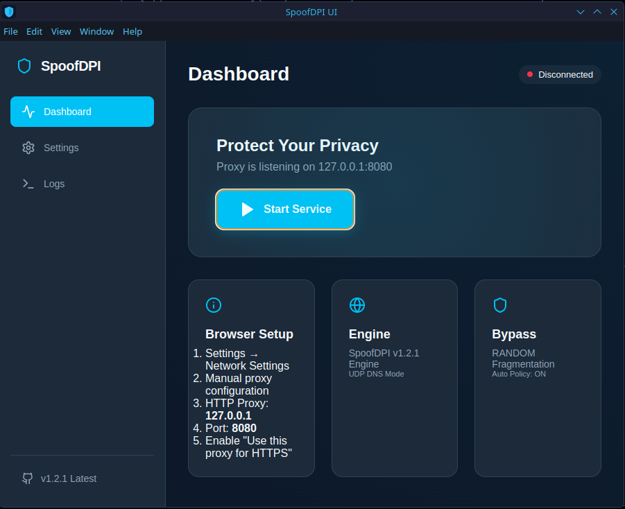
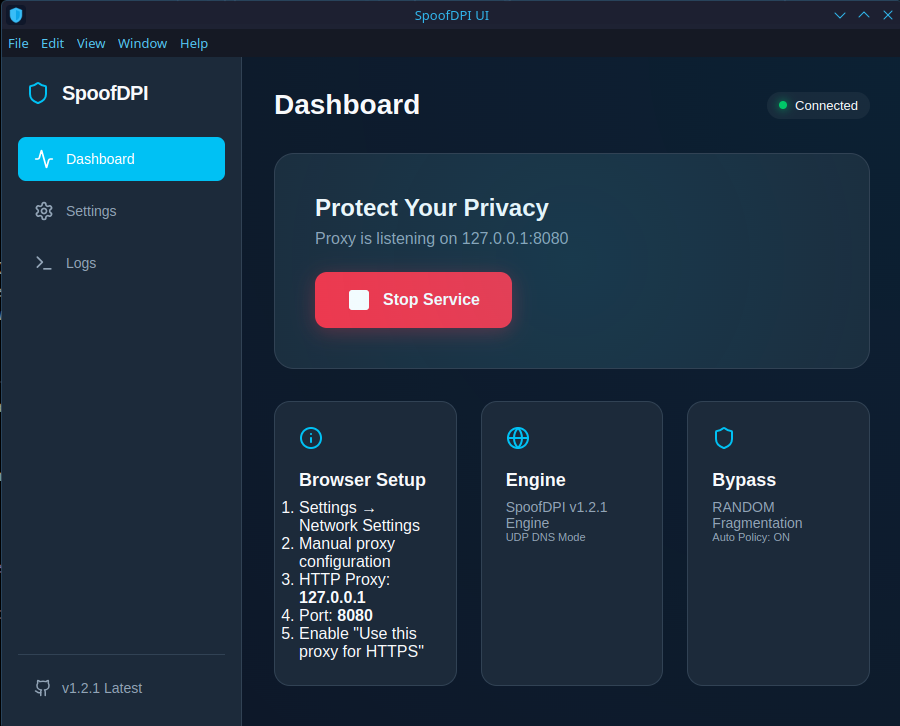
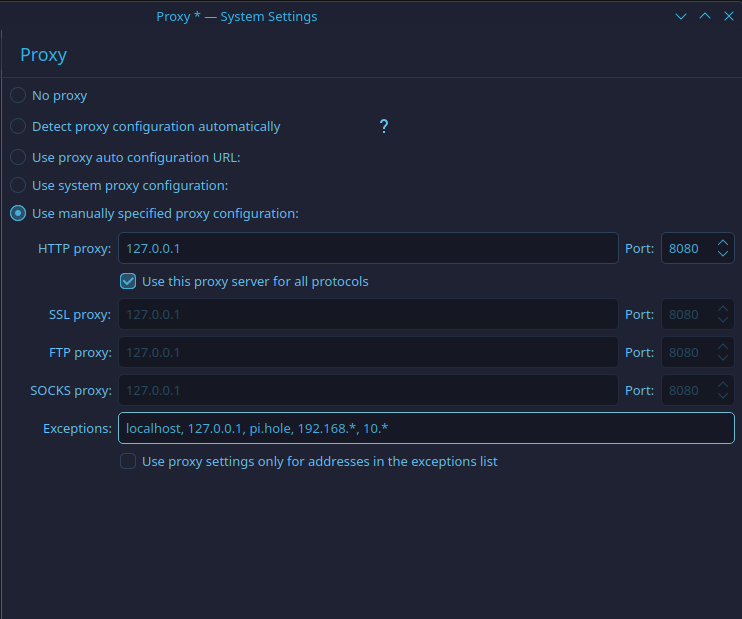

# SpoofDPI UI (Stable v1.2.1)

A modern, beautiful desktop application for **SpoofDPI**, an anti-censorship tool designed to bypass Deep Packet Inspection (DPI) by manipulating network traffic.

This project is a high-performance graphical interface for the excellent [xvzc/SpoofDPI](https://github.com/xvzc/SpoofDPI) project, built for stability and ease of use.


## 📸 Screenshots




## ✨ Features

- **One-Click Proxy:** Start and stop the SpoofDPI service with a single button.
- **Modern Dashboard:** Real-time status indicator and connection summary.
- **Latest v1.2.1 Engine:** Full support for the latest stable features including `random` fragmentation and `https-disorder`.
- **DNS Options:** Toggle between standard UDP, DNS-over-HTTPS (DoH), and System DNS.
- **Setup Guide:** Integrated instructions for configuring Firefox and other browsers.
- **Live Logs:** Monitor intercepted traffic and DPI bypass activity in real-time.

## 🚀 Getting Started

### Download
Grab the latest **AppImage** from the [Releases](https://github.com/Elias966/spoofdpi-ui/releases) page.

### Usage
1.  **Run the AppImage:**
    ```bash
    chmod +x spoofdpi-ui.AppImage
    ./spoofdpi-ui.AppImage
    ```
2.  **Start Proxy:** Click the "Start Service" button.
3.  **Configure Browser:**
    - Open **Firefox Settings** → **Network Settings**.
    - Select **Manual proxy configuration**.
    - HTTP Proxy: `127.0.0.1`, Port: `8080`.
    - Check **"Also use this proxy for HTTPS"**.

## ☕ Support
If you find this project useful, consider supporting me:

[](https://www.buymeacoffee.com/Maxnoon)

## 🛠️ Built With
- **Backend:** Electron (Node.js) + [SpoofDPI v1.2.1 Stable Binary](https://github.com/xvzc/SpoofDPI)
- **Frontend:** React + TypeScript + Vite
- **Icons:** Lucide React

## 📄 License
This UI wrapper is released under the MIT License. The core SpoofDPI binary is licensed under the Apache-2.0 License by [xvzc](https://github.com/xvzc).

---
**Disclaimer:** This is an independent UI wrapper. All credit for the DPI bypass logic goes to the original author of [SpoofDPI](https://github.com/xvzc/SpoofDPI).

### 🌐 Local Network Exceptions
If you have trouble connecting to local devices (like a Pi-hole, router, or local server), add these to your browser's "No Proxy for" list or the system proxy like i did:

```text
localhost, 127.0.0.1, pi.hole, 192.168.*, 10.*
```


